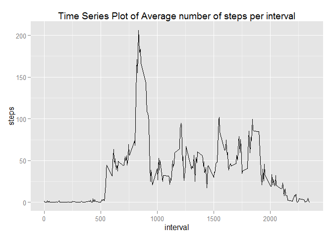
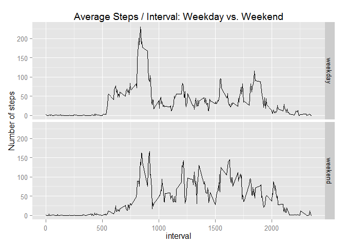

# Reproducible Research: Peer Assessment 1

#### Loading the data

```r
# Setting the working directory to the csv location
setwd("C:\\Users\\Gal\\Documents\\GitHub\\RepData_PeerAssessment1")

# Unzip the file (if not unzipped already)
if(!file.exists("activity.csv")) {
        temp <- tempfile()
        download.file("http://d396qusza40orc.cloudfront.net/repdata%2Fdata%2Factivity.zip",temp)
        unzip(temp)
        unlink(temp)
}

# Read the CSV file
activity <- read.csv("activity.csv")
```

### What are the mean and median total number of steps taken per day?
For this submission I selected to treat missing values (NA) as zero values. 

```r
# Summarize of the steps for each day into the data frame
# stepsperday <- aggregate(steps ~ date, activity, sum)$steps
stepsperday <- data.frame(tapply(activity$steps, activity$date, sum, na.rm=TRUE))

# Fix the names so that column 'steps' would be accesible for calc. 
names(stepsperday) <- "steps"

# Calculate the mean number of steps taken per day
mean_steps <- mean(stepsperday$steps)
mean_steps 
```

```
## [1] 9354.23
```


```r
# Claculate the median number of steps taken per day
median_steps <- median(stepsperday$steps)
median_steps 
```

```
## [1] 10395
```


```r
# The following plot is of the original data. 
barplot(stepsperday$steps, names.arg = stepsperday$date, xlab = "date", ylab = "steps")
```

 

### What is the average daily activity pattern?

```r
# Create a data frame containing the mean number of steps for each interval
avgstepsperinterval <- data.frame(tapply(activity$steps, activity$interval, mean, na.rm=TRUE))

# Fix the names so that column 'steps' would be accesible for calc. 
names(avgstepsperinterval) <- "steps"

# Add a new variable for the interval
avgstepsperinterval$interval <- as.integer(row.names(avgstepsperinterval))

# Create a plot using ggplot
library(ggplot2)
ggplot(avgstepsperinterval) + aes(x=interval, y=steps) + geom_line() + labs(title="Time Series Plot of Average number of steps per interval")
```

 

```r
# Determine which interval contains the maximum number of steps
names(which.max(avgstepsperinterval$steps))
```

```
## [1] "835"
```
## Imputing missing values
##### 1. The total number of missing values in the dataset is:

```r
sum(is.na(activity$steps))
```

```
## [1] 2304
```
##### 2. Devise a strategy for filling in all of the missing values in the dataset.
The selected strategy uses the 5-minutes intervals mean values to fill the missing values.

##### 3. Create a new dataset that is equal to the original dataset but with the missing data filled in.

```r
for (i in 1:nrow(activity)) {
    # apply logic on missing data
    if(is.na(activity$steps[i])) {
        activity$steps[i] <- avgstepsperinterval$steps[which(avgstepsperinterval$interval==activity$interval[i])]
    }
}
```
Checking the data is imputed to all 'na' fields.

```r
sum(is.na(activity$steps))
```

```
## [1] 0
```
##### 4.1 Make a histogram of the total number of steps taken

```r
# Summarize of the steps for each day into the data frame
stepsperday <- data.frame(tapply(activity$steps, activity$date, sum))

# Fix the names so that column 'steps' would be accesible for calc. 
names(stepsperday) <- "steps"

# The following plot is of the revised data. 
barplot(stepsperday$steps, names.arg = stepsperday$date, xlab = "date", ylab = "steps")
```

 

##### 4.2 Recalculating mean/median after filling NA data with mean for the 5-minutes interval

```r
# Calculate the mean number of steps taken per day
mean_steps <- mean(stepsperday$steps)
mean_steps 
```

```
## [1] 10766.19
```

```r
# Claculate the median number of steps taken per day
median_steps <- median(stepsperday$steps)
median_steps 
```

```
## [1] 10766.19
```

### Are there differences in activity patterns between weekdays and weekends?
##### 1. Create new factor variable

```r
# Creating a new factor variable "daytype" to distinguish between weekdays and weekends
activity$daytype <- "weekday"
activity$daytype[weekdays(as.Date(activity$date), abb=T) %in% c("Sat","Sun")] <- "weekend"
```
activity$daytype contains an indication per each day, being either "weekday" or weekend"

```r
table(activity$daytype)
```

```
## 
## weekday weekend 
##   12960    4608
```

##### Split the data sets into weekdays and weekends

```r
# split activity.imp by "daytype"
s <- split(activity, activity$daytype)

# create data frames containing the mean number of steps for each interval
avgsteps.weekday <- data.frame(tapply(s$weekday$steps, s$weekday$interval, mean))
avgsteps.weekend <- data.frame(tapply(s$weekend$steps, s$weekend$interval, mean))

# fix the variable names
names(avgsteps.weekday) <- "steps"
names(avgsteps.weekend) <- "steps"

# add new variables for the interval
avgsteps.weekday$interval <- as.integer(row.names(avgsteps.weekday))
avgsteps.weekend$interval <- as.integer(row.names(avgsteps.weekend))

# add new variables for the daytype
avgsteps.weekday$daytype <- factor(rep("weekday", nrow(avgsteps.weekday)), levels=c("weekday", "weekend"))
avgsteps.weekend$daytype <- factor(rep("weekend", nrow(avgsteps.weekend)), levels=c("weekday", "weekend"))
```
##### 2. Make a panel plot containing a time series plot

```r
# combine datasets (weekday and weekend)
avgsteps.merged <- rbind(avgsteps.weekday, avgsteps.weekend)

# create a plot using ggplot
ggplot(avgsteps.merged) + aes(x=interval, y=steps) + facet_grid(daytype ~ .) + geom_line() + labs(title="Average Steps / Interval: Weekday vs. Weekend", y="Number of steps")
```

 
